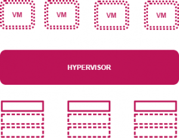

>  다음 글을 참고하였습니다. https://www.baeldung.com/cs/virtualization-intro#introduction

### 1. 소개

가상화란 컴퓨터 리소스를 논리적으로 분할하는 기술이다. 이것은 자원 분리의 근본적인 복잡성을 추상화하며 이뤄진다. 오래된 기술이지만, 가상화는 여전히 인기있고, 클라우드 시대에 깊이 관련된 기술이다. 이 글에서는, 가상화의 컨셉, 유형, 작동 등의 다양한 측면을 다룰 것이다.

### 2. 가상화란 무엇인가?

**가상화는 컴퓨터 자원의 소프트웨어 기반 가상 버전을 만드는 것이다.** 여기서 말하는 컴퓨터 자원은 컴퓨터 기기, 저장공간, 네트워크, 서버 또는 애플리케이션을 포함하여 말한다. 

가상화는 **단일 물리적 컴퓨터 또는 서버를 여러 가상머신(VM)으로 분할**할 수 있게 한다. 각각의 VM은 하나의 컴퓨터에서 자원을 공유함과 동시에, 독립적으로 상호작용하고, 서로 다른 OS나 애플리케이션을 실행할 수 있다.

### 3. 가상화는 어떻게 작동하는가?

**[하이퍼바이저](https://www.redhat.com/ko/topics/virtualization/what-is-a-hypervisor#:~:text=%ED%95%98%EC%9D%B4%ED%8D%BC%EB%B0%94%EC%9D%B4%EC%A0%80%EB%8A%94%20%EA%B0%80%EC%83%81%20%EB%A8%B8%EC%8B%A0,%ED%95%98%EA%B3%A0%20%EA%B5%AC%EB%8F%99%ED%95%98%EB%8A%94%20%EC%86%8C%ED%94%84%ED%8A%B8%EC%9B%A8%EC%96%B4%EC%9E%85%EB%8B%88%EB%8B%A4.&text=%EC%84%9C%EB%A1%9C%20%EB%8B%A4%EB%A5%B8%20%EC%97%AC%EB%9F%AC%20%EA%B0%9C%EC%9D%98%20%EC%9A%B4%EC%98%81,%EC%9D%98%20%ED%95%B5%EC%8B%AC%EC%A0%81%EC%9D%B8%20%EC%9D%B4%EC%A0%90%EC%9E%85%EB%8B%88%EB%8B%A4.) 소프트웨어는 가상화를** **용이하게** 한다. 하이퍼바이저는 운영 체제 위에 있지만 하드웨어에 직접 설치할 수도 있다. **하이퍼바이저는 물리적 리소스를 가져와 가상 환경이 사용할 수 있도록 분할한다** .

사용자 또는 프로그램이 물리적 환경에서 추가 리소스가 필요한 명령을 VM에 발행하면 하이퍼바이저는 요청을 물리적 시스템에 전달하고 변경 사항을 캐시합니다.

